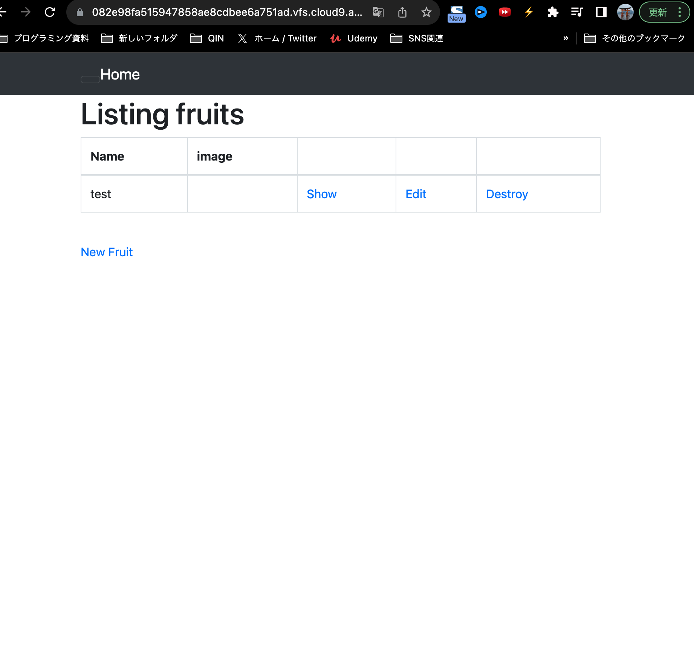
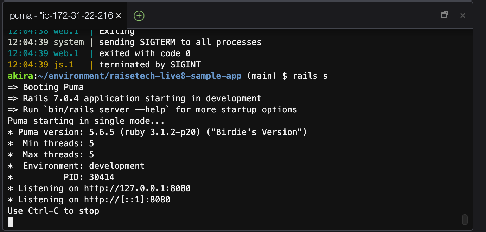
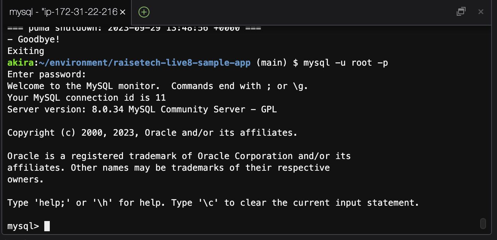
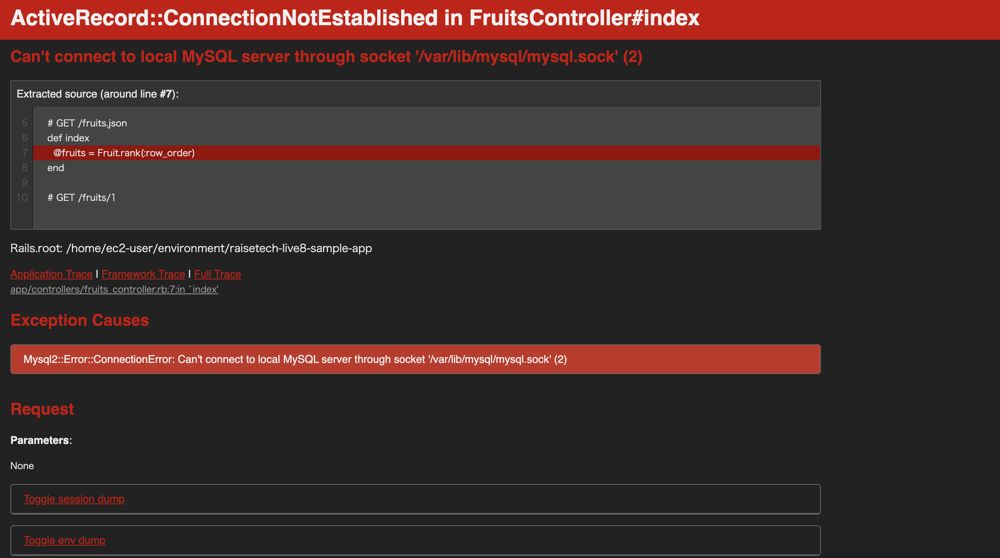

# 第 3 回課題提出

## サンプルアプリケーションのデプロイ

### AP サーバーについて

アプリケーションプログラムを動作させるサーバのこと。
Unicorn や Puma などの Web サーバを利用して、サーバ構築を行うことになる。
今回の課題では Puma を利用。

### AP サーバーの名前とバージョンの確認

サーバー名、バージョン
Puma version: 5.6.5 (ruby 3.1.2-p20)

### AP サーバーを終了させた場合

アクセスできずエラーが出る。（Oops No application seems to be running here!）
再度起動後アクセスを確認（rails s or bin/cloud9_dev）

### DB サーバーについて

MySQL (version:8.0.34)

### DB サーバーを終了させた場合

- AP サーバーを停止させた時と同様にエラーが出た。再起動によりアクセスを確認。

- sudo service mysqld status 状態確認
- sudo service mysqld stop 停止
- sudo service mysqld start 起動
- sudo service mysqld restart 再起動
  

- MySQL の停止コマンドに関しては調べると"mysql.server stop"と出てくるが、cloud9 には対応していないのかエラーとなった。

### Rails の構成管理ツールの名前

- Bundler（version:2.3.14)
- Bundler のメリットは、更新頻度の多い gem のバージョンまで細かく管理が可能

### 今回の課題から学んだこと

- 誤った操作をしていないのにエラーが出た場合は再起動によって直ることが多かった
- 保存をしないと情報が更新されないので、小まめに保存する必要性を学んだ
- mysql.sock の場所を調べるには、mysql_config で調べられる
